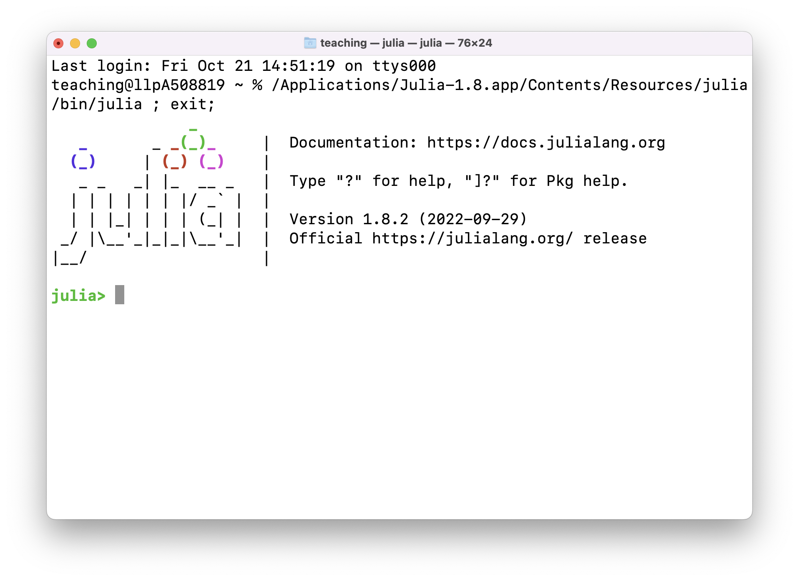
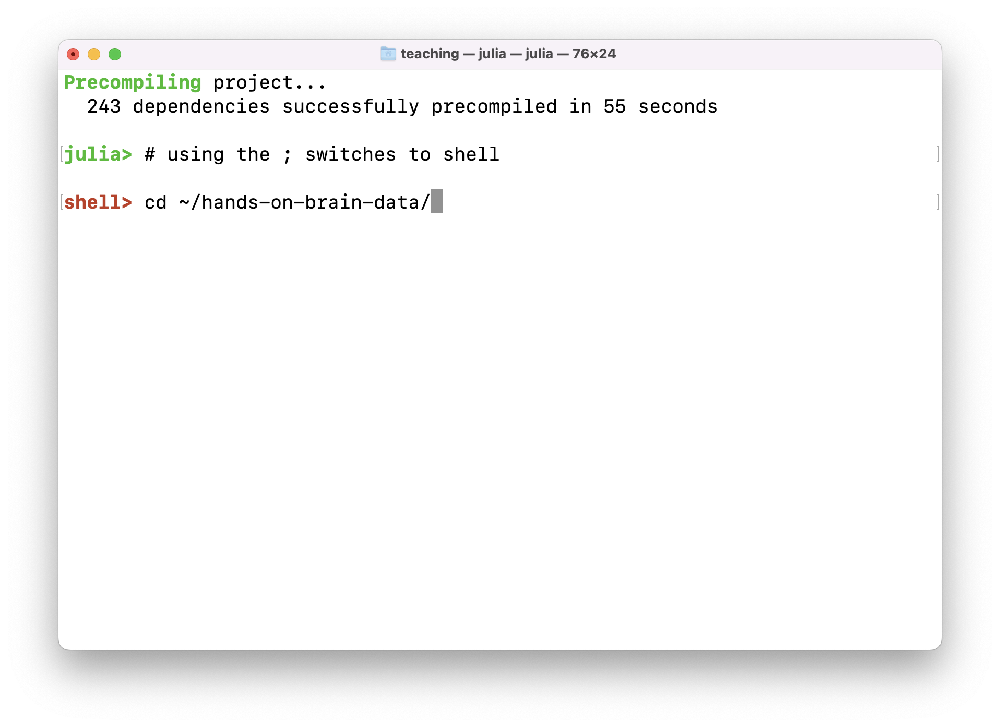
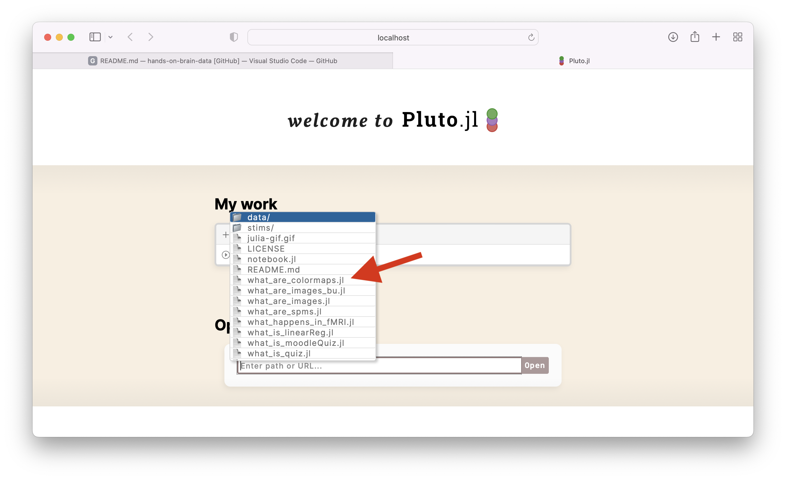
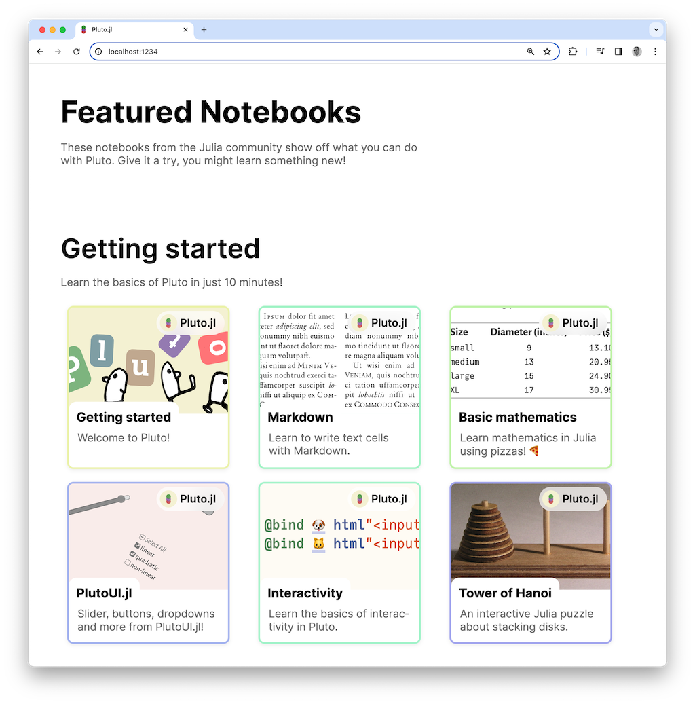

# hands-on-brain-data

Denis Schluppeck, started Sept/Oct 2020.

This material provides some details for reproducing the animations / interactive examples I have used to for teaching in my 2nd year undergraduate lab in **neuroimaging**, as well as part of the MSc Cognitive Neuroscience course.

You could also used this as a starting point for learning a bit of scripting / programming for your  own data analysis with #julialang with sample MRI data shown in class.

 

## Getting set up

- install `julia` and `pluto.jl` as per excellent instructions [in this youtube clip](https://www.youtube.com/watch?v=OOjKEgbt8AI&list=PLP8iPy9hna6Q2Kr16aWPOKE0dz9OnsnIJ&index=21&t=204s)

- clone or download this repository:
```bash
cd ~
git clone https://github.com/schluppeck/hands-on-brain-data.git
```
```bash
# wait for it to download / clone and then change directory into it
cd hands-on-brain-data
# you can now look around at the files in this folder
ls
pwd # print working directory: where are you in the file hierarchy?
```

- Next, start the `julia` interpreter by double-clicking the app icon or start `julia` in the shell, if you have set it up. You can install dependencies at this point, but if you are going to run the notebooks with `Pluto` you can also do that from within that environment

   

Try and run the Pluto notebook you want to explore. The first time you run it, you will have to be a bit patient, as some additional packages may need to be installed)

```julia
# change directory to the folder with the downloaded files...
# using the ; changes the prompt to red / shell
;  
cd ~/hands-on-brain-data
# BACKSPACE to go back to the julia prompt
using Pluto

# for versions 1.9 onwards, the julia package manager will ask you if you
# want to install this package if you don't already have it... say [y]

Pluto.run()
# and open specific notebook in browser
```



**A good place to start is the notebook `what_are_images.jl`.** Load it, Click `Run Notebook code` at the top of the page... the first time you do this, it may take 30s to a minute to update packages.... you can look at the `Status` (by clicking the status button at the bottom right... this will show you progress of what's happening. Second time aroud, the code will run *much* faster).

## Additional resources

- If you scroll to the bottom of the `Pluto` launch window, you can also find some `Featured Notebooks` which are a good place to find your feet with `julia` and `Pluto`.



- Grant Sanderson has a brilliant video explaining images, etc. [in the second class of this MIT OpenCourseWare lecture](https://www.youtube.com/watch?v=DGojI9xcCfg&list=PLP8iPy9hna6Q2Kr16aWPOKE0dz9OnsnIJ&index=2
), which is part of a whole course on [Computational Thinking](https://www.youtube.com/playlist?list=PLP8iPy9hna6Q2Kr16aWPOKE0dz9OnsnIJ).

Enjoy!
