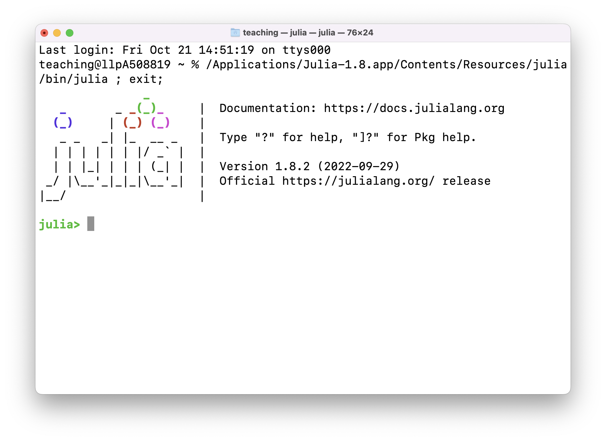
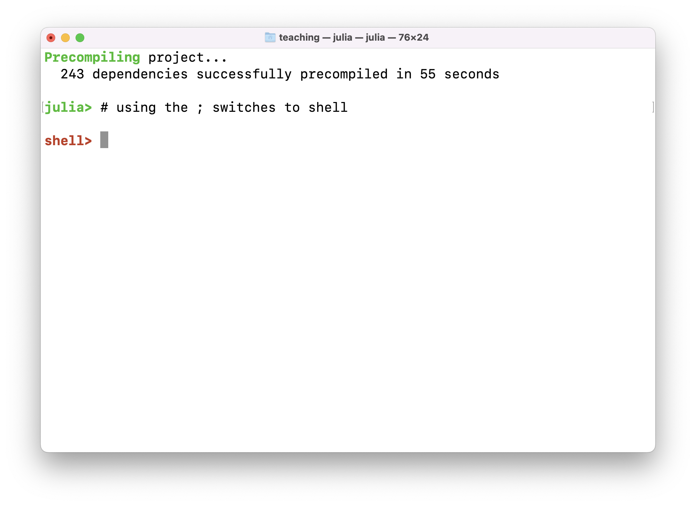
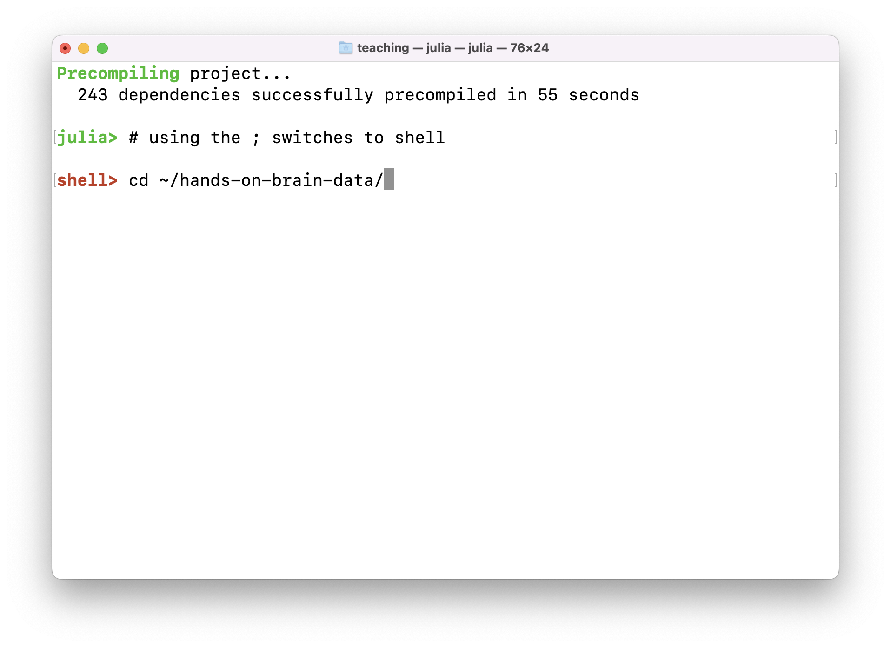
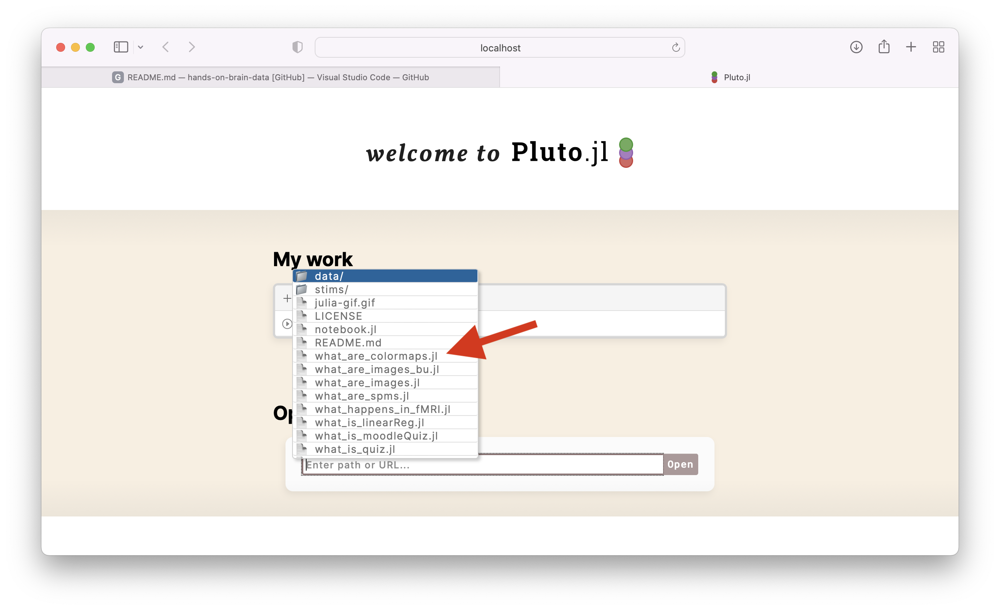

# hands-on-brain-data

Denis Schluppeck, started Sept/Oct 2020.

This material provides some details for reproducing the animations / interactive examples I have used to for teaching in my 2nd year undergraduate lab in **neuroimaging**. 

You could also used this as a starting point for learning a bit of scripting / programming for your  own data analysis with #julialang with sample MRI data shown in class.

 

## Getting set up

- install `julia` and `pluto.jl` as per excellent instructions [in this youtube clip](https://www.youtube.com/watch?v=OOjKEgbt8AI&list=PLP8iPy9hna6Q2Kr16aWPOKE0dz9OnsnIJ&index=21&t=204s)

- clone or download this repository:
```bash
cd ~
git clone https://github.com/schluppeck/hands-on-brain-data.git
```
```bash
# wait for it to download / clone and then change directory into it
cd hands-on-brain-data
# you can now look around at the files in this folder
ls
pwd # print working directory: where are you in the file hierarchy?
```

- Next, start the `julia` interpreter by double-clicking the app icon or start `julia` in the shell, if you have set it up. Then make sure you have the dependencies (packages installed).:

   


```julia
p = ["DataFrames","DelimitedFiles", "GLM", "NIfTI","Images","ImageView","Plots","Pluto","PlutoUI","StatsPlots"]
import Pkg
Pkg.add(p)
# there are other ways to do this, too...
```

Then run the Pluto notebook you want to explore. The first time you run it, you will have to be a bit patient, as some additional packages may need to be installed)

```julia
# change directory to the folder with the downloaded files...
# using the ; changes the prompt to red / shell
;  
cd ~/hands-on-brain-data
# BACKSPACE to go back to the julia prompt
using Pluto
Pluto.run()
# and open specific notebook in browser
```




Enjoy!
